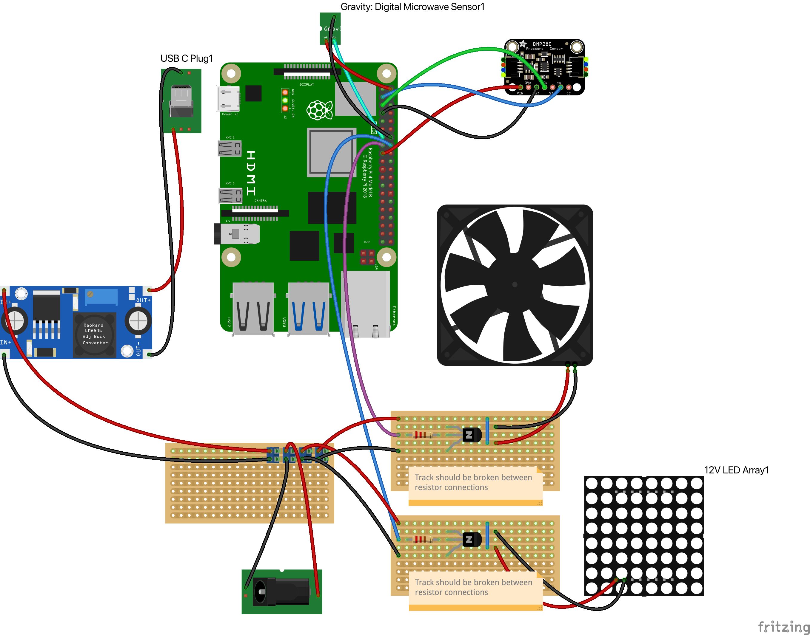

# Doogle Cam

# Materials

- 12V IR LED array
- Raspberry PI 4B 4GB
- Raspberry PI IR camera preferably 160° ultra low light (Arducam Pivariety Ultra Low Light Wide-angle STARVIS IMX462)
- 12v 3A buck converter with 5v output
- USB Type C Female Male Connector Breakout Board (https://www.ebay.co.uk/itm/203928815751)
- DC Power Jack Socket (5.5 x 2.1)
- Infrared transmitting acrylic disc with 21mm center hole (https://www.ebay.co.uk/itm/232103052621)
- Circles clear acrylic disc 19mm (https://www.ebay.co.uk/b/Timed-Offers/bn_7116144158)

# Circuit

[Fritzing](https://fritzing.org/) circuit available [here](circuit.fzz).

# Setup Heatsink Fan

1. Attach heatsink control cable to pin 14
2. `sudo nano /boot/firmware/config.txt`
3. Set `dtoverlay` to `gpio-fan,gpiopin=14,temp=60000`