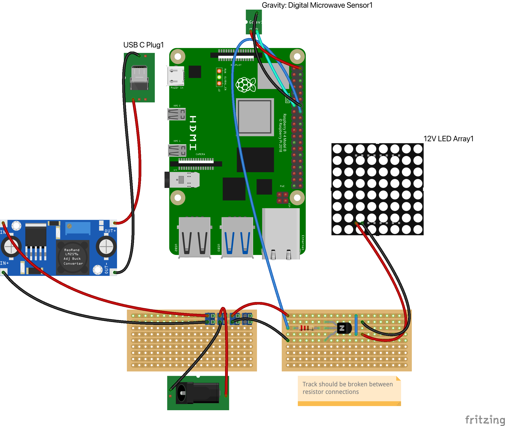

# Doogle Cam

# Materials

- 12V IR LED array
- Raspberry PI 4B 4GB
- Raspberry PI IR camera preferably 160° ultra low light (Arducam Pivariety Ultra Low Light Wide-angle STARVIS IMX462)
- 12v 3A buck converter with 5v output
- USB Type C Female Male Connector Breakout Board (https://www.ebay.co.uk/itm/203928815751)
- DC Power Jack Socket (5.5 x 2.1)
- Infrared transmitting acrylic disc with 21mm center hole (https://www.ebay.co.uk/itm/232103052621)
- Circles clear acrylic disc 19mm (https://www.ebay.co.uk/b/Timed-Offers/bn_7116144158)
- Gravity Digital Microwave sensor

# Circuit

[Fritzing](https://fritzing.org/) circuit available [here](circuit.fzz).



# Install

1. Change `.env.example` to `.env` and configure `DOOGLE_SERVER_HOST` with the IP of your machine running the Doogle server
2. Copy the contents of ./cam to the Raspberry PI
3. Run `make install`
4. Restart the Raspberry PI `sudo reboot`

# API

# Activity
Method: GET
http://dooglecam.local:5000/activity/

# Videos
Method: GET
http://dooglecam.local:5000/videos/

# Video
Method: GET
http://dooglecam.local:5000/video/<filename>

# System Info
Method: GET
http://dooglecam.local:5000/system_info/

# Infrared LED Control
Method: POST
http://dooglecam.local:5000/ir_leds/
```
{
  "ir_led_behavior": "on | off | auto"
}
```